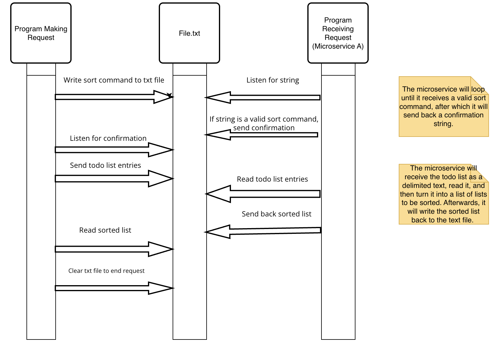

# To Do List Item Sorter
## Description:
This service sorts a to-do list by days until due, priority level, or alphabetically when it reads "D", "P", or
"A", respectively, over a text file. 

## Requires:
Python3 
Text file communication 
the Python time library 

## How to REQUEST Data:
    with open(filename: String, "w") as file:
        file.write(sort_command: String)
>
Once the command has been written to a text file, confirmation will be sent back as the string "Received"
After receiving confirmation, a delimited list will need to be written to the file. Here is an example:
>
    with open("file.txt", "r+") as file:
     confirmation = file.read()
     if confirmation == "Received":
        delimiter = ","
        with open("file.txt", "w") as file:
        for row in data:
           line = delimiter.join(row) + "\n"
           file.write(line) 

## How to RECEIVE Data:

    todo_list = []  
    with open("file.txt", "r") as r_file:
        task = r_file.readlines()
        temp = []
        for y in [x.split(',') for x in task]:
            for z in y:
                temp.append(z.replace('\n', ''))
        for i in range(0, len(temp), 4):
            todo_list.append(temp[i:i + 4])

## UML Sequence Diagram:

